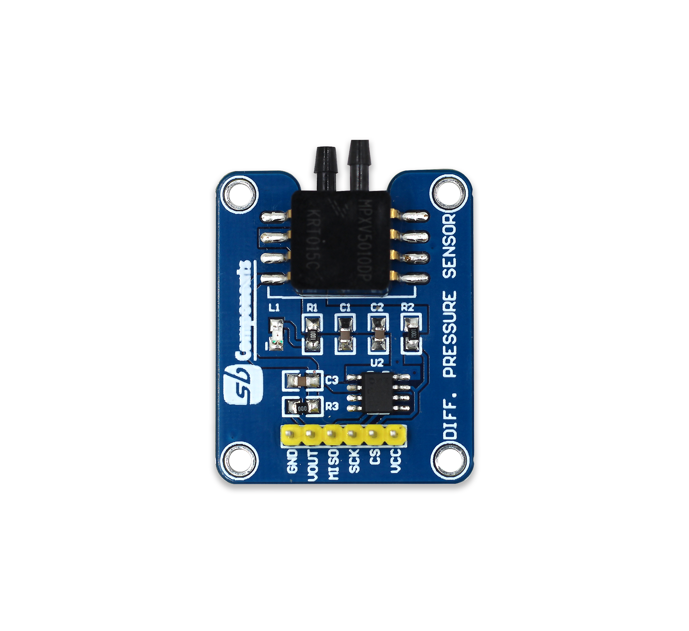
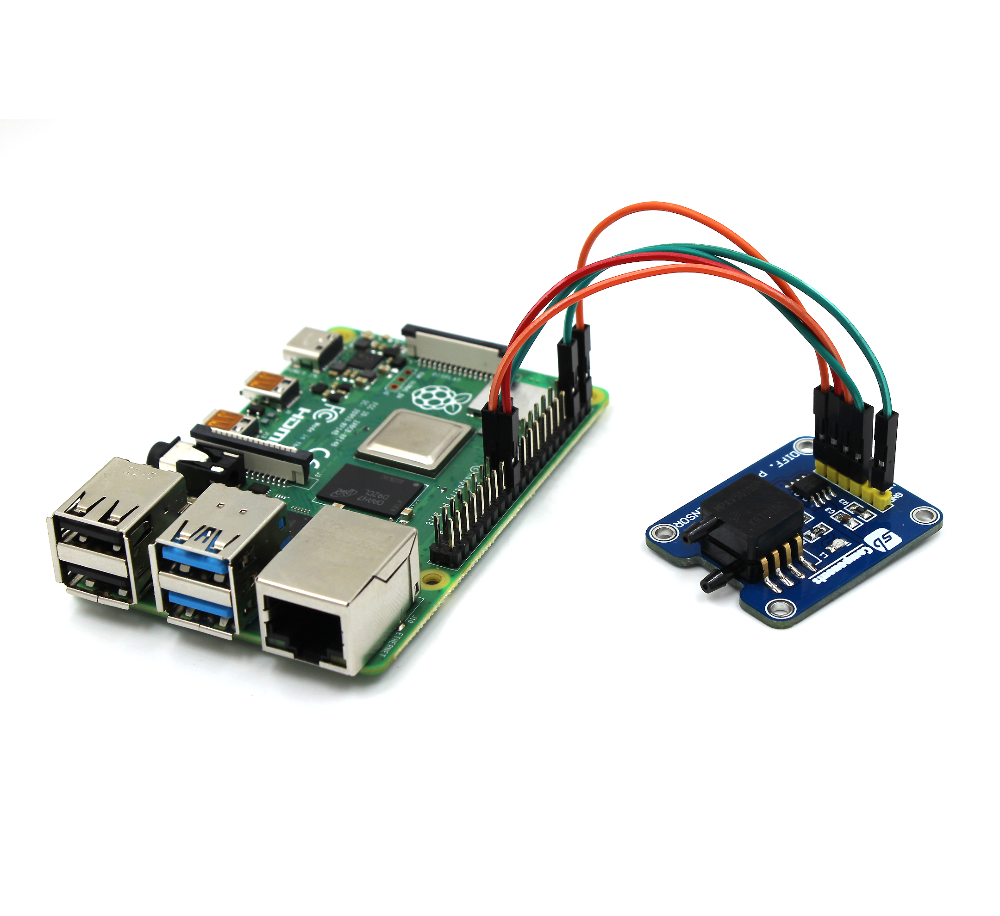
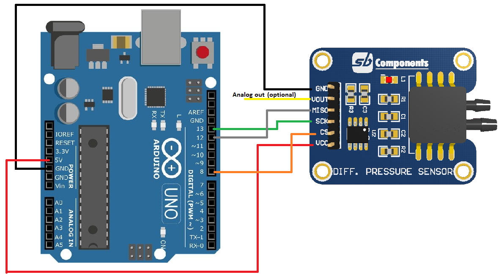
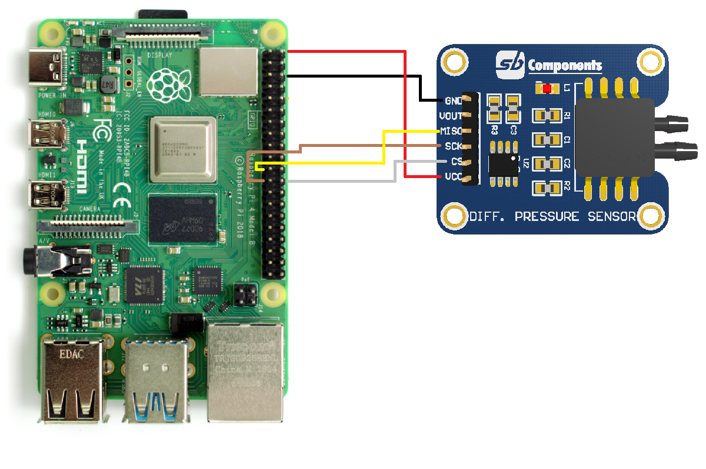
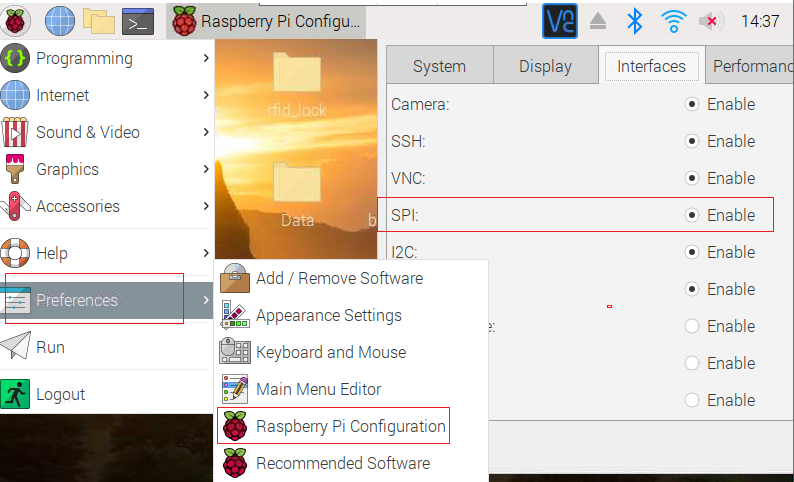

# Differential Pressure Sensor breakout for Arduino/Raspberry Pi/STM32

Differential Pressure Sensor is the latest technology in the range of SB Component products that comprises NXP's MPXV5010DP that is an Integrated Silicon Pressure Sensor On-Chip Signal Conditioned, Temperature Compensated, and Calibrated.



## Circuit Diagram

### With Arduino



* Now upload arduino code to see output on serial terminal. 

### With Raspberry Pi

* First make connection as below diagram with raspberry pi.



* Now enable SPI of raspberry pi using menu as shown below or using raspi-config command



* Now clone this repository and run python file on python3 to see output of this breakout board on raspberry pi python shell or on terminal.

``` 
    cd Differential-Pressure-Sensor-Breakout
    cd Python
    python3 diff_pressure.py


